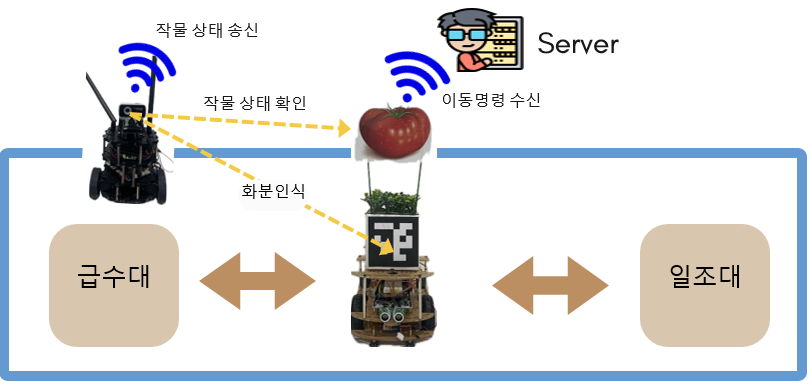
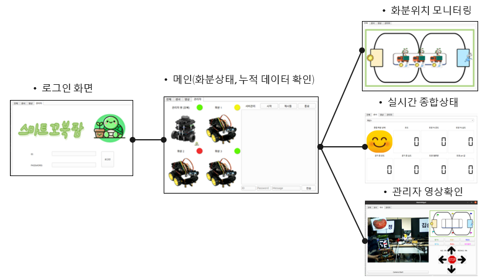

# SmartTurtleFarm Project
AIoT, Turtlebot, Line Tracer를 이용한 스마트팜

## Team members
1. 정용재
2. 김윤우
3. 김지훈
4. 유지승
5. 이지원

## Purpose
- 기존 식물 재배기에 작물 맞춤관리, 작물 상태 자동 확인 기능 추가
- 고정된 화분 대신 라인트레이서를 이용하여 움직이는 화분 시스템
- 터틀봇을 활용한 실시간 모니터링 시스템

## HW 구성도

## SW 구성도

## System 구성
1. Linetracer
   - STM32, PWM, Timer, UART
   - 초음파 센서, 온습도 센서, Water Pump, Servo Motor
   - 서버와 socket 통신
2. Turtlebot & AI
   - 실내 자동, 수동 주행
      ROS, Qt, C++, Linux
   - 식물 상태 모니터링
      Jetson Nano, Yolov8, Tensorflow, OpenCV, Python
   - 서버와 socket 통신
3. Server
   - Qt,SQLite, TCP/IP, Wi-fi, C++, Linux

